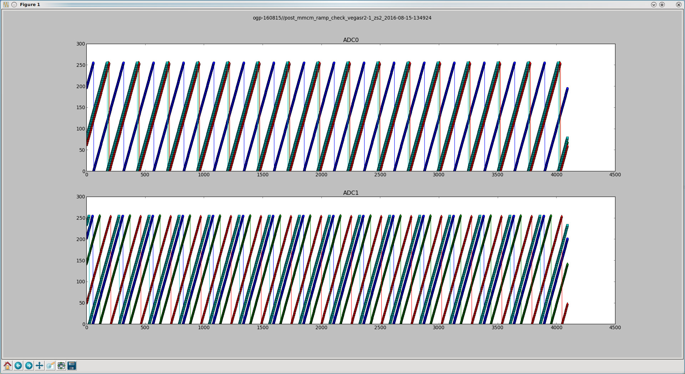
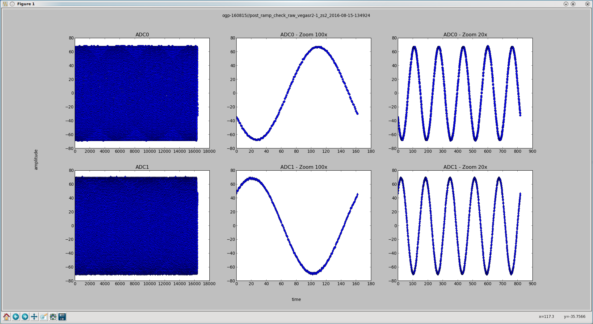
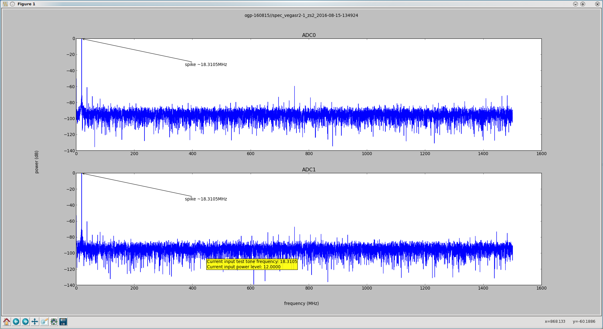
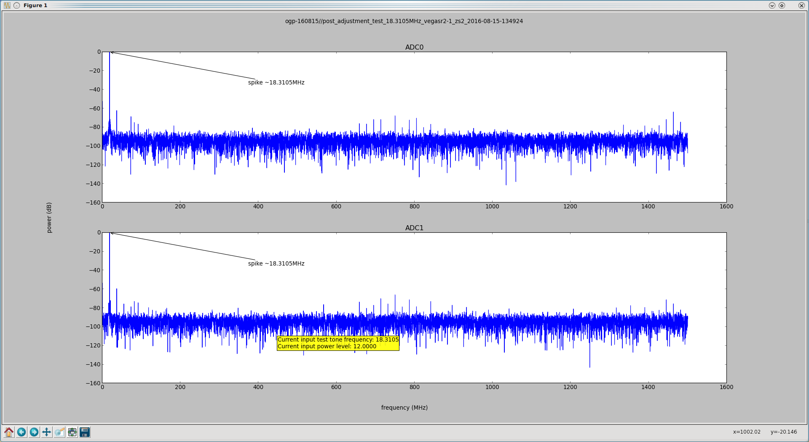

# Library for Calibrating ADC5G

* [Introduction](#id-intro)
* [Background](#id-background)
* [Glossary](#id-glossary)
   * [Calibration Types](#id-caltypes)
   * [Hardware Setup](#id-hardware)
   * [Usage Overview](#id-usage)
      * [Examples](#id-examples)
   * [Details](#id-details)
      * [Source Code](#id-source)
      * [Output Files](#id-output)
      * [Calibrations and Observations](#id-observations)
      * [Detailed Examples](#id-detailed-examples)

# Introduction

The Roach 2 boards used for Vegas and DIBAS each have two ADC cards.  On the time scale of a few times a year, these cards need to be calibrated.  In addition, whenever the boards are power cycled, reprogrammed or clockrate changed, some of these different calibration results need to be reloaded.

This document describes the AdcCalibration code, which performs the above tasks.

_NOTE_: There appears to be more then one way to calibrate these ADCs.  The methods encapsulated in this code work for the GBT Vegas-derived backends.  For more information on alternative methods, contact the casper mailing list.

# Installation

You may have the correct libraries needed for this package already installed, but in case you do not, here is how to install both this package and the libraries needed.

   * clone this repo (git clone https://github.com/nrao/adc5g_devel)
   * create a virtualenv: (virtualenv adc5g-env)
   * activate the env: (source adc5g-env/bin/activate)
   * install the latest pip: (pip install -U pip)
   * use this to install the env as specified in the repo: (pip install -r adc5g_devel/requirements.txt)
   * if you have root permissions on your machine:
      * install corr 0.6.7 with pip: (pip install corr=0.6.7)
      * if you do not, install corr 0.6.7 by hand:
         * download the corr-0.6.7 package and untar
         * cd into the corr-0.6.7 folder
         * edit setup.py: edit out the last line concerning data_files
         * install it: (python setup.py install)

Once you have setup the environment, check that all the unit tests pass:

   * cd adc5g_devel/test
   * python AllTests.py

# Background

   * This code is based off Hong Chen's version of Jack Hickish's code: https://github.com/jack-h/adc_tests
   * See Hong Chen's usage notes of the original code: ADC5GNotes.pdf
   * See the data sheet on this device: Ev8aq160.pdf
   * See this wiki page for more details: https://safe.nrao.edu/wiki/bin/view/GB/Software/VegasADCCalibration

# Glossary

   * MMCM - Is the "mixed mode clock manager".  This is used for correcting the phase of the capture clock between the four cores.  Depending on where the rising edge of the capture clock lies, glitches in the ADC samples can occur.  The ADC has the ability to provide test ramps that they use to detect glitches and adjust the MMCM appropriately to eliminate them.  One must eliminate the glitches before applying the ogp & inl corrections (see below).

   * OGP - Offset, Gain, Phase.  The offset correction really takes care of 95% of the ADC calibration.
   * INL - Integral Non Linearity.
   * SPI -  The Serial Peripheral Interface or SPI bus is a synchronous serial data link, a de facto standard, named by Motorola, that operates in full duplex mode. It is used for short distance, single master communication, for example in embedded systems, sensors, and SD cards.
   * zdok - 0 or 1. Basically refers to one of the two ADC cards.

# Calibration Types and Dependencies

As mentioned above, there are 3 types of calibration measurements: MMCM, OGP, and INL.  Some of these depend on different factors, so different calibration results will need to be tracked for different conditions.

MMCM - these values change with every different bof file and roach board clockrate used.  In addition, everytime the roach board is reprogrammed these values must be reset.  In addition, these calibration results can change slightly between each calibration run, and ALSO, there can more then one valid result.

OGP - these values depend on roach board clockrate.  They only need to be reloaded after a power cycle, or when the clockrate changes. 

INL - the values do not depend on bof or clockrate.  They need only be reloaded after a power cycle.

# Hardware Setup

   * In order to perform the OGP and INL calibration routines to gather the coefficients, a test tone must be connected to the input of each ADC board.  This is *NOT* required for reloading the coefficients, only for performing the calibration, as mentioned above, on the time scale of a few times a year.
   * This test tone is not required for performing the MMCM correction.
   * It would be preferable to use either the HP 83620A or the Agilent E8257D synthesizer to provide the test tone, because these synthesizers are known to be compatible with the GPIB.py routine used in the calibration code.  Other synthesizers may have a different GPIB command set, requiring a modification to GPIB.py.
   * An ethernet-to-GPIB adapter is required to be compatible with the GPIB.py routine.  It is preferable that the PROLOGIX GPIB-ETHERNET CONTROLLER is used because it is known to work well in this hardware configuration.  This device connects to the GPIB port on the back of the synthesizer, and also to the LAN.  This allows the software to send GPIB commands to the synthesizer over the network.
   * Disconnect the IF input to the ADC boards, and connect the test tones in their place.  It has been found that a nominal power level of -3dBm at the ADC input works well.
   * Once the calibration is complete, remove the test tone inputs, and re-connect the IF signals to the ADC boards.
   * _NOTE_: It may be that the synthesizer used for the test tone does not support the GPIB interface that the software uses.  In this case, the software will silently fail when trying to change the test tone amplitude and frequency.  One should check whether this is the case, and, in case of failure, change the synthesizer settings manually when needed.

# Overview of usage

As stated in the introduction, this code is for finding and reloading different calibration results for the adc5g cards.  Here's a brief overview of how to use this code.  

First, make sure your hardware is setup properly: 
   * Is the roach on the network?  Can you connect to it with a katcp client?
   * Are the necessary bof files accessible to the roach (roach.listbof())
   * Attach a test tone to the ADC input, and make sure it's at the default frequency (18.30 MHz).  This is needed for the OGP and INL calibrations.

Now, run some experimental trials on just one roach board using _adc\_calibration.py_.  This will help you determine whether the test tone is setup properly.  Use the default settings for this script so that results are not written to the <roachname>-adc.conf file. You can use the -d option for writing the various output files to a different directory if you want to manage all the files better.

Once you are confident that calibrating a single roach board for specific conditions (bof, clockrate) is working, try running _adc\_all\_calibrations.py_ for a single roach board, writting the results to the roachname-adc.conf file.  This may take a few minutes.  If this looks good, go ahead and run the same script for all your roach boards. 

## Examples
cd into working directory

   * cd adc5g_devel

(DIBAS users only: setup your envirnoment)

   * source /home/dibas/dibas.bash

check that you are running python 2.6 or 2.7

  * python --version

make a temporary directory to store output files 

  * mkdir tmp

make sure your roach and synthisizer are on the network

  * ping 'roach_name'
  * ping 'synth_ip_address'

make sure that any other software programs that might be interacting with the roach are shutdown.  For example, for the GBT, the Vegas Manager must be turned off.

run a test run on one roach, computing the mmcms, ogps, and inls for just one bof and clockrate (defaults).  Here's where you make sure your test tone is at the right frequency and amplitude, etc.  Run more then once if need be.  (_NOTE_: if running this program does not change the synthesizer settings, the hardware and software may be incompatible, and the synthesizer may need to be changed by hand).

  * python adc_calibration.py -r 'roach_name' -g 'synth_ip_address' -d tmp

run a test run on one roach, but testing all bof and clockrates needed, and writing the results to the 'roach_name'-adc.conf file.

  * mkdir conf
  * cp 'path to conf file' conf/.
  * python adc_all_calibrations.py -r 'roach_name' -g 'synth_ip_address' -d tmp -c conf

finally, run the full calibration for all your roaches

  * python adc_all_calibrations.py -r 'roach_name_1','roach_name_2','roach_name_N' -g 'synth_ip_address' -d tmp -c conf

# Details

## Files and Classes:

### High-level scripts
   * _adc\_all\_calibrations.py_:  This is the main entry point for calibrating all your roach boards in all sets of conditions (bof, clockrate)
   * _adc\_calibration.py_:  This is the main entry point for calibrating a single roach board, one set of conditions (bof, clockrate) at a time. 
   * _adc\_load\_calibration.py_: This is the main entry point for reloading calibration results from files.
   * _adc\_read\_only\_check.py_: This is an entry point for simply taking snapshots of the ADC data and reading the current OPG and INL values.

### Classes and other files:   
   * _adc\_cal\_logging.conf_: This is the configuration file used by the logger for this software package.
   * _roachname-adc.conf_: Where 'roachname' is the name of the roach.  This is where the different ADC calibration values for the named roach can be stored.
   * _ADCCalibrations.py_: A top-level class that utilizes _ADCCalibrate.py_ for calibrating multiple roach boards in all necessary conditions (bof, clockrate).
   * _ADCCalibrate.py_: The ADCCalibrate class is the main top-level class used by some of the entry points ('main's) described above.  It is used for calibrating a single roach board in a single set of conditions (bof, clockrate).  It in turn uses a suite of helper classes (see below) to perform the actual calibration.  It may interact with the user.
   * _MMCM.py_: This is a mid-level class that is responsible for performing the MMCM calibration.  It does not directly interact with hardware.
   * _OGP.py_: This is a mid-level class responsible for obtaining and/or loading the Offset, Gain, and Phase measurements.  It does not directly interact with hardware.
   * _INL.py_: This is a mid-level class responsible for obtaining and/or loading the Integral Non Linearity measurements.  It does not directly interact with hardware.
   * _SPI.py_: This is a low-level class that is responsible for communicating with the ADC cards via the FPGA's 'adc5g_controller' pseudo-register.  It *does* interact directly with hardware.
   * _AdcSnapshot.py_ : This is a low-level class responsible for taking 'snapshot's of the ADC data via the FPGA.  It *does* interact directly with hardware.
   * _GPIB.py_: This is a low-level class responsible for communicating with a synthesizer via gpib for setting only frequency and amplitude.  It *does* interact directly with hardware.
   * _ADCConfFile.py_: This is a simple class for reading/writing to/from the roachname-adc.conf file.
   * _fit\_cores.py_: This module does the fitting needed for the OGP/INL calculations.
   * _valon\_katcp.py: Simple module used for controlling the valon synth that drives the roach boards clockrate.

## Output Files

The calibration code produces a lot of output files.  Some are just of intermediate in nature and can probably be ignored.  There are two main types:

   * plot .png files: these have filenames that match the pattern [title]_[roach]_z[zdoks]_[timestamp].png, where zdoks can be 0,1, or 2 for *both* zdoks.
   * data files: these have filenames that match the patter [tittle]_[roach]_z[zdok]_[timestamp].[ext], where zdok is always either just 0 or 1.  Title can be in the set (ogp, inl, snapshot_raw).

Heres a listing of some of the important data files:

   * ogp_[roach]_z[zdok]_[timestamp] : these hold the calibration results for the OGP.  This is one of the calibration files that get loaded.
   * inl_[roach]_z[zdok]_[timestamp].meas : these hold the calibration results for the INL.  This is one of the calibration files that get loaded.
   * inl_[roach]_z[zdok]_[timestamp] : TBF - what is this file for?
   * snapshot_raw_[roach]_z[zdok]_[timestamp].dat* - TBF

Here's some of the important plot files:

   * post_adjustment_test_[freq]MHz_[roach]_z[zdoks]_[timestamp].png - this spectral line plot is produced after changes in [freq] when adc_calibration.py promts for new frequencies to test (after calibrations).
   * post_mmcm_ramp_check_[roach]_z[zdoks]_[timestamp].png - a raw data plot done after the MMCM calibration phase. 
   * raw_startup_[roach]_z[zdoks]_[timestamp].png - a raw data plot done before calibrations are completed.

You can control where these files are written to via the high-level script command line options.

## Calibration Measurements and Observations

The code in this repository is for *producing* calibration values of various types for the ADC cards.  How these measurements are used during observations depend on the details of the observation system being used.  As stated above, here are the guidelines for when calibrations must be performed and/or calibration values loaded:

   * all calibration values must be either reproduced and/or reloaded after a roach board power cycle.
   * MMCM - these must be calculated *every* time the roach board is reprogrammed.  This can be done using 'calibrate_mmcm_phase' in _MMCM.py_.
   * OGP - these values must be reloaded every time the roach board clock rate is changed.
      * Use the _ADCConfFile_ class to read the *.conf files that were written during the calibration process.
      * Reload these values using 'set_offsets', 'set_gains', and 'set_phases' in _OGP.py_.
   * INL - these values must be reloaded only after a roach board power cycle.  Use methods similar to what was used for the OGP values.

As an example, the GBT VEGAS backend (and other backend systems based off it) uses the concept of 'mode'.  Each mode may require a different BOF file and/or roach board clock rate.  In this case, every time the mode is changed:
   * MMCMs are recalculated.
   * OGPs are reloaded.

Finally, it is a good idea to track changes in the *.conf files used to hold the ADC calibration measurements.  For the GBT, we keep these files under revision control.
  

## Detailed Examples

### Interactive ADC Calibration Example

Here we show the expected output from using the adc_calibration command described in the usage overview above.

After setting up our hardware, we make sure things are working by using the command adc_calibration.py;  specifically in our example case, we issue this command:

_python adc_calibration.py -r vegas-r1 -g 10.16.98.63 -d ogp-160815_

The resulting log file (adc_cal_vegasr2-1_z2_2016-0815-134920.log
) can be viewed in doc/example_calibration.

Now we will show what the expected plots from running this command are:

   * Once the MMC calibratoin is run, this plot is displayed (found in the logs at the line "2016-08-15 13:49:38,252 - adc5gLogging - DEBUG - ADCCalibrate - Saving file :ogp-160815//post_mmcm_ramp_check_vegasr2-1_zs2_2016-08-15-134924.png").  This is a plot of each ADC card, top and bottom.  Each half consists of the 'ramps' of the 4 cores in each ADC card.  Since the MMCM calibration has been done, there should be no 'glitches' - that is, data points that are not on the ramp.

 

   * Next, we move on to the 'Checking if the synthesizer is connected correctly' section.  Here we are capturing snapshots of the ADC data to make sure that our test tone looks healthy.  Again, the upper and lower halfs represent the two different ADC cards.  The 3 plots in each half represent the signal at different zoom levels.  If everything is working correctly, a healthy looking sine wave should appear in these plots.  However, if the amplitude of the test tone is too high, you'll be able to see clipping here.  (found in the logs a the line "016-08-15 13:49:55,094 - adc5gLogging - INFO - ADCCalibrate - Checking raw data... zdok: 2 save:1 filename: ogp-160815//post_ramp_check_raw_vegasr2-1_zs2_2016-08-15-134924").

 

   * An FFT of the input is displayed so that the noise spectrum of the ADCs can be viewed before any further calibration is done.  This plot can be used to verify that noise has been reduced after calibrations have been applied.  Note that the plot shoule report on the test tone spike, and that the frequency is the expected value.

   * In the next few steps, the user is prompted whether they want to change the test tone amplitude.  If the user responds yes, they can step through a loop where they can provide a new amplitude for the test tone, and snapshots of the ADC input are again presented (reminder, if the GPIB interface does not work, they'll have to change the amplitude by hand).  If the user chooses not to change the amplitude they are still shown the ADC input one more time, redundantly.

   * Finally, the OGP & INL calibrations are performed for both ADC cards.  After this, the user is asked if they want to check the spectrum.  This is a good idea.  The resulting plot (shown below) can be compared to the pre-calibration plot to check that the noise has indeed been reduced.  (found in the log near the line "2016-08-15 13:53:35,184 - adc5gLogging - DEBUG - ADCCalibrate - Saving file :ogp-160815//post_adjustment_test_18.3105MHz_vegasr2-1_zs2_2016-08-15-134924.png")  

   * Before the program is finished, the user is asked if they would like to do further characterizations of the system.  If everything has gone well so far, this step is usually skipped.

   

